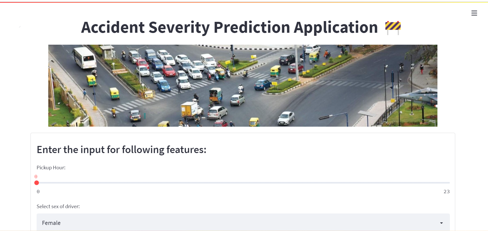

# Road Traffic Severity Classification🚦

## Web Application :computer: :earth_americas: : 
Built a web application using Streamlit and deployed on Heroku.

## Check it out
https://traffic-severity-prediction.herokuapp.com/

## Introduction
With the increasing of road traffic infrastructures, motor vehicles, drivers, and traffic flow, the role of road traffic in supporting and guiding economic and social development is becoming more and more obvious. As a result, road traffic safety has increasingly become a key issue in concerning the safety of people’s lives and property, as well as affecting the quality and efficiency of economic and social development. Road traffic accidents are the process of simultaneous damage of people or things, which caused by the coupling imbalance of dynamic and static factors such as human, vehicle, road, and environment. Therefore, it is necessary to study the influencing factors, as well as the classification and identification model of the severity of road traffic accident, so as to pave the way for improving the safety level of road traffic.

## 🧭 Problem Statement: 
This is a multi-class classification problem where we are predicting the severity of accident :
* Slight Injury
* Fatal Injury
* Serious Injury

based on the other 31 features.

## 🧾 Description: 
This data set is [Road Traffic Accidents](https://www.kaggle.com/saurabhshahane/road-traffic-accidents) from Kaggle. The data set has been prepared from manual records of road traffic accident of the year 2017-20. All the sensitive information have been excluded during data encoding and finally it has 32 features and 12316 instances of the accident.

### :bar_chart: Exploratory Data Analysis:
* Exploratory Data Analysis is the first step of understanding your data and acquiring domain knowledge. 

### :hourglass: Data Preprocessing:
* The dataset has around 16 features with missing values. This missing values are imputed using **Predictive Imputation** technique where I used the known values to predict the missing values.

### ⚖ Handeling Data Imbalance:
* The Dataset was quite imbalanced with 10415 records with Slight injury, 1743 records withSerious injury anf just 158 records with Fatal injury.
* I used **SMOTE**, Random Under/Over Sampling, NearMiss method for balancing the dataset. 

### :mag_right: Features Selection:
* On using **Correlation** and **Chi-square** method, I found that some features were moderately correlated so I removed the features with collinearity. Finally, we use 16 feature for training process.

### ⚙ Model Training:
* On training my model using several classification algorithms such as *XGBoost*, *Random Forest*, *Extra Trees*, *Decision Trees*, the model trained with **XGBoost** gave good results and less memory. 
* Used **KFold** with 5 splits cross validation with hyper-parameter tuning on XGBoost Classifier (baseline model) using **GridSearchCV**.
* Also, I found that my baseline model (XgBoost Classifier) was overfitting the dataset. On investigation I found that the dataset was affected by **Curse of Dimensionality**. So I reduced the dimensions and trained my model again.
* After retraining my model, I found that it was generalizing well with an accuracy of **74%**.
* As per the problem statement I used **F1 Score** as the evaluation metric for my model.

